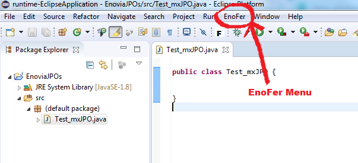
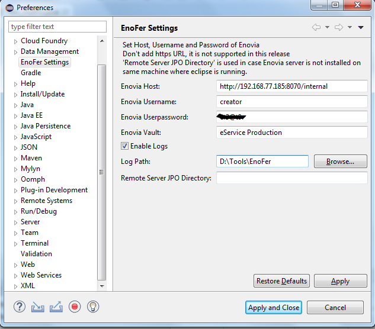

# EnoFer
Eclipse Plugin for Enovia / 3DEXPERIENCE Platform 

## Download latest version

[Download Link](https://github.com/fervort/EnoFer/releases/download/v2.0.0.beta/Enofer_1.0.0.beta_binary.zip)

## How to build & deploy the JAR
After downloading the plugin, you have to update `com.fervort.enofer_X.X.X.X.jar` file with the latest version of `eMatrixServletRMI.jar`

Steps :
  - Unzip the downloaded plugin
  - Copy `eMatrixServletRMI.jar` file from your web server into `lib` folder of the unzipped plugin. In case of TomEE, it is located in path `/webapps/internal/WEB-INF/lib` folder
  - Run `buildJAR.bat` script. This script will copy `eMatrixServletRMI.jar` you have just pasted in `lib` folder into the JAR `com.fervort.enofer_X.X.X.X.jar` . If you are sucessful, you will see change in size and timestamp of JAR file.

  - Copy updated JAR `com.fervort.enofer_X.X.X.X.jar` into your Eclipse plugin folder . 
  
  - Restart Eclipse.

## EnoFer Settings:

After restarting eclipse, you will see new Menu EnoFer is added in the main menubar. 

Go to Eclipse menu : `Windows -> Prefernces -> EnoFer Settings` . Fill the settings :

## How to Use:
EnoFer plugin provides basic features like insert program, compile program, extract program etc 

### Extract Program
Create a Java project in Eclipse and right-click on `src` folder. Go to `EnoFer -> Extract Program Here` . Select the Program and click okay. Programs will be exported in `src` folder. Right click on `src` folder and click `Refresh` or press F5 .

### Insert Program
Right-click on program and Go to `EnoFer -> Import this Program` . 

### Compile Program
Right-click on program and Go to `EnoFer -> Compile this Program` . 

## Known Issues:
- [ ] EnoFer menu is available on all right click
- [ ] Password is visible from settings.
- [ ] Unknown issues :wink:  

## Bugs, Issues, Help ?
Feel free to create an `issue` on GitHub.
    
